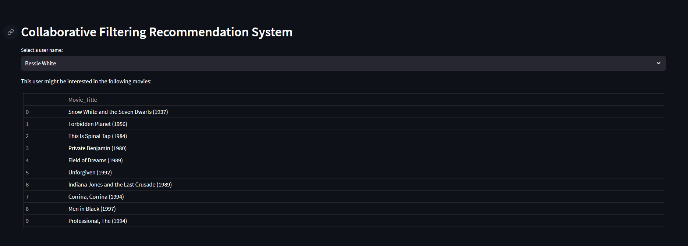
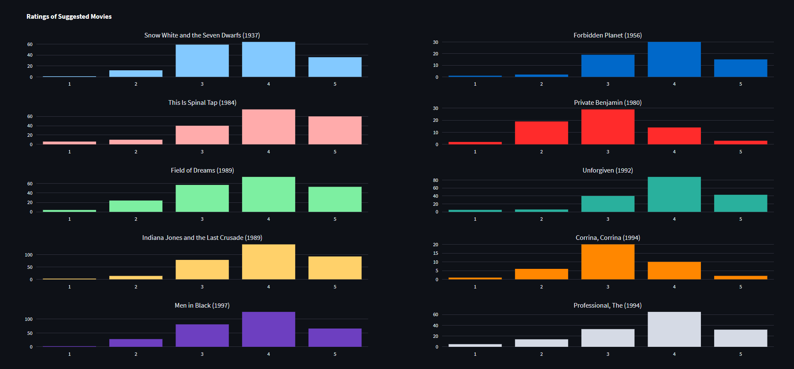

# Collaborative Filtering Recommendation Application

## Overview

A movie recommendation system built using collaborative filtering techniques to provide personalized movie suggestions. The system analyzes user rating patterns and similarities between users to generate relevant recommendations.




## Features

- User-based collaborative filtering algorithm
- Cosine similarity for user preference matching
- Movie rating analysis and visualization
- Support for 1600+ movies and 900+ users
- Personalized recommendations based on user history

## Installation

```bash
# Clone the repository
git clone https://github.com/yourusername/collaborative-recommender.git

# Change into project directory
cd collaborative-recommender

# Install required packages
pip install -r requirements.txt
```

## Requirements

```txt
pandas>=1.3.0
numpy>=1.21.0
scikit-learn>=0.24.0
streamlit>=1.0.0
plotly>=5.0.0
```

## Dataset

The system utilizes two main data files:

- `Movie_data.csv`: Contains user ratings and interactions
  - User_ID
  - User_Names
  - Movie_ID
  - Rating (1-5 scale)
  - Timestamp

- `Movie_Id_Titles.csv`: Movie metadata
  - Movie_ID
  - Movie_Title

## Usage

Run the Streamlit web application:

```bash
streamlit run app.py
```

The interface allows you to:
1. Select a user from the dropdown menu
2. View rating distributions and statistics
3. Get personalized movie recommendations

## How It Works

1. Creates a user-movie interaction matrix
2. Computes user similarities using cosine similarity
3. Identifies most similar users for a given target user
4. Aggregates highly rated movies from similar users
5. Filters out previously watched movies
6. Returns top-N movie recommendations

## Project Structure

```
collaborative-recommender/
├── CollaborativeFiltering.ipynb   # Core recommendation algorithm
├── app.py                         # Streamlit web interface
├── Movie_data.csv                 # User rating dataset
├── Movie_Id_Titles.csv           # Movie information
├── requirements.txt              # Package dependencies
└── README.md                     # Project documentation
```

## Statistics

- Number of Users: 944
- Number of Movies: 1,682
- Total Ratings: 100,003
- Matrix Sparsity: 6.3%

## Contributing

1. Fork the repository
2. Create a feature branch
3. Commit your changes
4. Push to the branch
5. Open a Pull Request

## License

This project is licensed under the MIT License - see the LICENSE file for details.